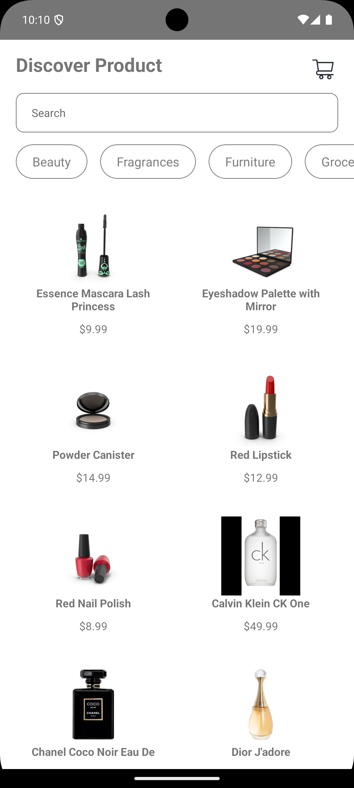
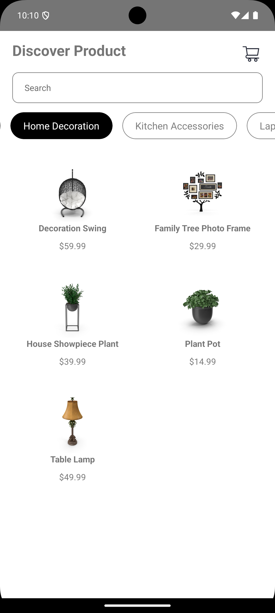
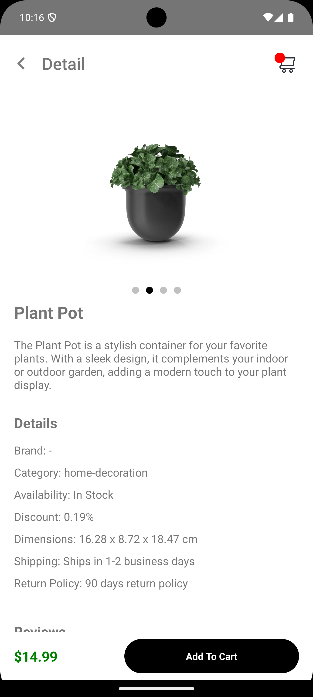

# React Native Listing Product App

This is a simple e-commerce application built with React Native that allows users to view products

## Screenshoot
[](home.png)
[](home-filter.png)
[](detail-product.png)

## Features

- **Product Listing**
- **Detail Product**

this app made by API from https://dummyjson.com/docs/products

## Installation

To get started with the project, follow these steps:

1. Clone the repository:

   ```bash
   git clone https://github.com/dhiyo7/React-Native-Product.git
   cd Product-Listing
   ```
2. Install the necessary dependencies:
   ```
   npm install
   ```
   or
   ```
   yarn install
   ```
3. Start run the app:
   ```
   npx react-native run-android
   ```
   ios
   ```
   npx react-native run-ios
   ```